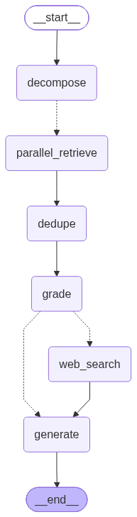

# Vietnamese Legal Assistant — RAG Chatbot

Dự án thực hành **xuyên suốt Module I (LLM Engineer)**. Mỗi buổi học bồi đắp thêm code
vào cùng một codebase, hội tụ dần thành hệ thống capstone: một trợ lý pháp lý tiếng Việt
dùng RAG.

> **Triết lý:** dùng **native SDK** (OpenAI, Qdrant...) thay vì framework cao cấp, để
> engineer hiểu và kiểm soát từng lời gọi. **API-first** với FastAPI.

---

## Lộ trình xây dựng

| Buổi | Chủ đề | Lắp vào codebase |
|------|--------|------------------|
| **1** | LLM APIs Hands-on | `llm/`, `api/`, `prompts/`, `schemas/`, `tools/` — **chatbot chạy được** |
| **2** | Local LLMs | `llm/backends.py` + `client.py` đa backend, `Modelfile` — **chạy model local** |
| **3** | Fine-tuning LoRA/QLoRA | `training/` — QLoRA SFT + merge, deploy qua backend Buổi 2 |
| **4** | Embeddings & Vector DB | `retrieval/embeddings.py` (OpenAI), `vectorstore.py` (Qdrant) — **stub → thật** |
| **5** | RAG Pipeline | `loader`, `chunking`, `retriever` (native) + `ingest.py` → **RAG hoàn chỉnh** |
| **6** | Agentic RAG | `agent/` — CRAG + Query Decomposition (LangGraph, mọi call native) |
| 7 | Evaluation & Guardrails | `guardrails/`, `eval/` |
| 8 | Production Optimization | `optimization/` (caching, routing) |
| 9 | Capstone | Gradio UI + deploy HF Spaces |

### Buổi 1 đang ở đâu?

Chatbot **đã chạy được** với đầy đủ kiến thức Bài 1: chat completions, parameters,
streaming, structured output, function calling, rate-limit handling.

`retrieval/retriever.py` hiện là **stub trả về rỗng** → chatbot trả lời chỉ dựa vào
kiến thức sẵn có của model, **chưa dựa trên tài liệu thật**. Đây là "lỗ hổng RAG" có
chủ đích, sẽ được lấp ở Buổi 4–5.

### Buổi 2 — Local Serving

Cùng một codebase giờ chạy được với **model local** (Ollama / vLLM) — không đổi
`completion.py` hay `pipeline.py`, vì Ollama/vLLM đều dùng **OpenAI-compatible API**.
Chỉ cần đổi backend trong `.env`.

#### Phương án A — Ollama (khuyến nghị cho laptop / GPU yếu / Apple Silicon)

```bash
# 1. Cài Ollama
#    macOS:  brew install ollama   (hoặc tải app tại https://ollama.com/download)
#    Linux:  curl -fsSL https://ollama.ai/install.sh | sh
#    Windows: tải installer tại https://ollama.com/download

# 2. Khởi động Ollama server (mặc định cổng 11434)
ollama serve          # để chạy nền; trên macOS app tự chạy sau khi mở

# 3. Pull model (terminal khác)
ollama pull llama3.2:3b

# 4. (Tùy chọn) Tạo model có sẵn persona pháp lý từ Modelfile
ollama create legal-assistant -f Modelfile

# 5. Kiểm tra nhanh
ollama run llama3.2:3b "Xin chào"

# 6. Trỏ app sang Ollama trong .env:
#    LLM_BACKEND=ollama
#    LLM_MODEL=llama3.2:3b        # hoặc legal-assistant
```

#### Phương án B — vLLM (GPU NVIDIA, production / nhiều người dùng)

```bash
# 1. Cài vLLM (cần GPU NVIDIA + CUDA)
pip install vllm

# 2. Serve model với OpenAI-compatible API (mặc định cổng 8000)
vllm serve meta-llama/Llama-3.2-3B-Instruct

# 3. Trỏ app sang vLLM trong .env:
#    LLM_BACKEND=vllm
#    LLM_MODEL=meta-llama/Llama-3.2-3B-Instruct
```

> vLLM chạy trên Linux + GPU NVIDIA. Trên macOS/Windows không có GPU NVIDIA thì
> dùng Ollama (Phương án A).

Sau khi backend chạy, khởi động app như thường: `uvicorn app.main:app --reload`.
Giờ mọi request đi tới model local — **không tốn chi phí API, dữ liệu không rời máy**.

| Backend | `LLM_BACKEND` | base_url mặc định | Cần key thật | Yêu cầu |
|---------|---------------|-------------------|--------------|---------|
| OpenAI Cloud | `openai` | api.openai.com | ✅ | — |
| Ollama | `ollama` | localhost:11434/v1 | ❌ | CPU / GPU yếu / Apple Silicon |
| vLLM | `vllm` | localhost:8000/v1 | ❌ | GPU NVIDIA + CUDA |

### Buổi 3 — Fine-tuning (LoRA / QLoRA)

Pipeline **offline** trong `training/` để fine-tune model cho giọng văn pháp lý +
format trích dẫn điều luật. Sau khi train + merge, model deploy qua **chính backend
Buổi 2** (Ollama/vLLM) — app không đổi, chỉ đặt lại `LLM_MODEL`.

```bash
python -m training.prepare_data     # kiểm tra dataset (không cần GPU)
python -m training.train_qlora      # train QLoRA adapter (cần GPU NVIDIA)
python -m training.merge_adapter    # merge adapter → model độc lập
```

> Chi tiết + decision framework (Prompt → RAG → Fine-tune): xem [`training/README.md`](training/README.md).
> Deps training tách riêng (`training/requirements-train.txt`) vì cần GPU NVIDIA.

### Buổi 4 — Embeddings & Vector Database

Lấp 2 stub retrieval đầu tiên (từ Buổi 1) bằng đồ thật:
- `retrieval/embeddings.py` → **OpenAI text-embedding-3-small** (1536 dims, gọi API)
- `retrieval/vectorstore.py` → **Qdrant** (HNSW, cosine; `:memory:` cho demo, server cho prod)

```bash
python -m scripts.index_demo    # embed vài đoạn luật → index → thử semantic search
```

> Embedding cần `OPENAI_API_KEYS` (kể cả khi chat chạy local — embedding luôn dùng Cloud).
> Qdrant mặc định `:memory:` (không cần Docker). Production: chạy Qdrant qua Docker rồi đặt
> `QDRANT_URL=http://localhost:6333`.

Buổi này mới dựng 2 **khối nền tảng**. `retriever.py` (nối chúng thành RAG hoàn chỉnh)
vẫn là stub trả `[]` — sẽ lắp ở **Buổi 5**.

### Buổi 5 — RAG Pipeline

3 stub cuối của retrieval → chatbot trả lời dựa trên tài liệu thật:
- `retrieval/loader.py` → đọc `.txt`/`.md`/`.pdf` (pypdf)
- `retrieval/chunking.py` → recursive character splitter (tự viết, 512/64)
- `retrieval/retriever.py` → semantic search + (tùy chọn) query rewriting + re-ranking

```bash
# 1. Khởi động Qdrant (bắt buộc để ingest và app dùng CHUNG dữ liệu)
docker compose up -d                # Qdrant ở http://localhost:6333
#    rồi trong .env:  QDRANT_URL=http://localhost:6333

# 2. Ingest tài liệu vào vector store (load → chunk → embed → index)
python -m scripts.ingest            # đọc data/legal_docs/ (có sẵn seed .md)

# 3. Chạy app — giờ /chat trả lời DỰA TRÊN tài liệu (RAG thật)
uvicorn app.main:app --reload
curl -X POST http://localhost:8000/chat \
  -H "Content-Type: application/json" \
  -d '{"question": "Công ty cổ phần cần tối thiểu mấy cổ đông?"}'
```

**Điểm mấu chốt:** `pipeline.py` không đổi một dòng — nó đã gọi `retrieve()` từ Buổi 1.
Giờ `retrieve()` trả chunk thật thay vì `[]` → toàn bộ chuỗi tự thành RAG.

Tính năng nâng cao bật qua `.env` (mặc định tắt để chạy nhẹ):
- `RAG_QUERY_REWRITING=true` — LLM viết lại câu hỏi trước khi search.
- `RAG_RERANK_ENABLED=true` — cross-encoder lọc lại (cần `pip install sentence-transformers`).

> **Vì sao cần Qdrant server (không dùng `:memory:`)?** `ingest` và `uvicorn` là hai
> tiến trình khác nhau. `:memory:` chạy in-process nên dữ liệu ingest sẽ KHÔNG thấy được
> từ app → `/chat` vẫn rỗng. Qdrant server (docker compose) là kho chung cho cả hai.

### Buổi 6 — Agentic RAG (CRAG + Query Decomposition)

RAG ở Buổi 5 là pipeline **cố định**: luôn retrieve → generate, không kiểm tra chất lượng. Buổi này thêm khả năng **quyết định**, dùng **LangGraph** để orchestrate.
<p align="center">
  
</p>

```
question → decompose (nếu câu hỏi dài/phức tạp) → retrieve (multi-hop, dedupe)
         → grade từng chunk (structured output) → đủ relevant?
             ├─ Có → generate
             └─ Không → web_search (Tavily) → generate
```

> Ảnh trên được sinh tự động bằng `python -m app.agent.graph` (xem `save_graph_visualization()` trong [`app/agent/graph.py`](app/agent/graph.py))
> chạy lại lệnh này để cập nhật ảnh mỗi khi sửa cấu trúc graph.

```bash
curl -X POST http://localhost:8000/chat/agent \
  -H "Content-Type: application/json" \
  -d '{"question": "So sánh điều kiện thành lập công ty TNHH và công ty cổ phần theo luật 2020"}'
```

Response trả thêm `sources`, `web_search_used`, `sub_questions` — để **thấy được**
model đã dùng chunk nào, có phải fallback web không, câu hỏi bị chia thành gì.

> Cần `TAVILY_API_KEY` cho web search fallback (free tier tại tavily.com). Nếu câu
> hỏi luôn tìm được chunk relevant trong Qdrant, fallback không bao giờ kích hoạt.

**Mọi node đều tái dùng code cũ:** `decompose`/`grade`/`generate` gọi `completion.chat_parsed`/`chat` (Buổi 1), `retrieve_node` gọi `retriever.retrieve` (Buổi 5). File mới duy nhất là `agent/tools_web.py` (Tavily) và phần orchestration.

---

## Cài đặt

```bash
conda create -n llm-engineer python==3.10
pip install -r requirements.txt

cp .env.example .env
# Mở .env, điền OPENAI_API_KEYS (một hoặc nhiều key, ngăn cách bằng dấu phẩy)
```

## Chạy

```bash
uvicorn app.main:app --reload
```

- Docs tương tác: <http://localhost:8000/docs>
- Health check (không cần key): <http://localhost:8000/health>

### Thử nghiệm

```bash
# Non-streaming
curl -X POST http://localhost:8000/chat \
  -H "Content-Type: application/json" \
  -d '{"question": "Công ty TNHH hai thành viên có tối đa bao nhiêu thành viên?"}'

# Streaming
curl -N -X POST http://localhost:8000/chat/stream \
  -H "Content-Type: application/json" \
  -d '{"question": "Tóm tắt điều kiện thành lập công ty cổ phần."}'

# Structured output
curl -X POST http://localhost:8000/chat/structured \
  -H "Content-Type: application/json" \
  -d '{"question": "Công ty cổ phần cần tối thiểu mấy cổ đông?"}'
```

## Test

```bash
pytest          # không gọi API thật (mock LLM), không cần key
```

---

## Cấu trúc

```
Modelfile              # Buổi 2 — Ollama model có sẵn persona pháp lý
app/
├── config.py          # đọc .env (điểm duy nhất chạm secrets)
├── main.py            # FastAPI app
├── pipeline.py        # orchestrator: retrieve(stub) → prompt → llm
├── api/               # FastAPI routes + request/response schemas
├── llm/               # native SDK: completion, streaming, backoff, key rotation
│                      #   + backends.py (Buổi 2: openai/ollama/vllm)
├── prompts/           # role prompting, few-shot, chèn context RAG
├── schemas/           # Pydantic structured output
├── tools/             # function calling
├── retrieval/         # ✓ RAG hoàn chỉnh: loader, chunking, embeddings, vectorstore, retriever, rerank
├── agent/             # ✓ CRAG + Query Decomposition: graph.py (LangGraph), nodes.py, tools_web.py (Tavily)
├── guardrails/        # STUB → Buổi 7
├── eval/              # STUB → Buổi 7
└── optimization/      # STUB → Buổi 8
```

> **Bảo mật:** `.env` đã nằm trong `.gitignore`. Không bao giờ commit API key.
